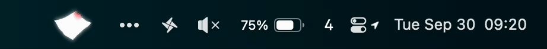
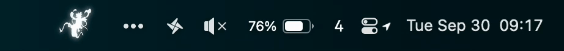
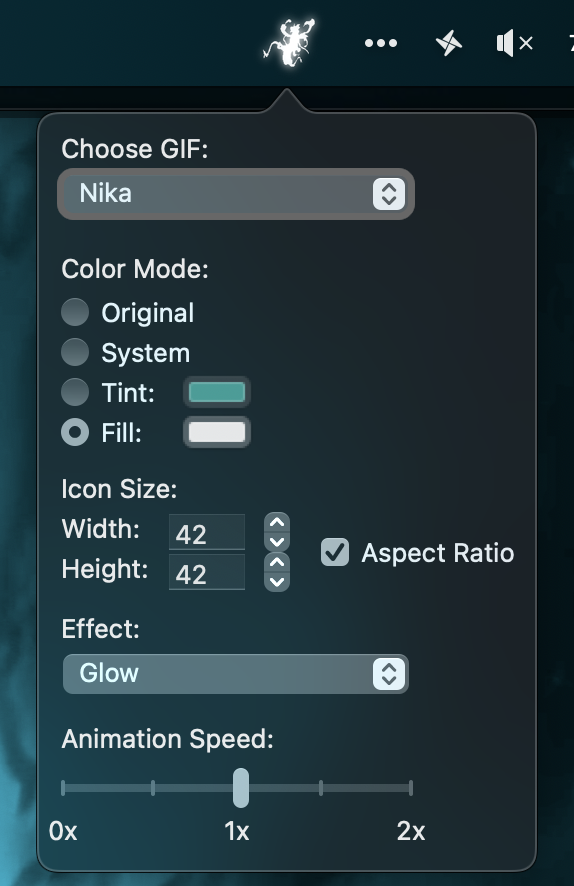

# VivreBar - README

A delightfully useless macOS menu bar app that brings GIFs to your menu bar with customizable effects and colors.

It initially was designed because I wanted a specific gif on my own menu bar, though I later decided to create the option to add other GIFs, just in case someone was looking for the same feature.

## Features

- **Animated Menu Bar Icons**: Display GIFs directly in your macOS menu bar
- **Built-in GIFs**: Comes with 2 One Piece animated GIFs
- **Custom GIF Support**: Upload and use your own GIFs
- **Color Modes**: 
  - **Original**: Keep the GIF's original colors
  - **System**: Allow macOS to automatically select the color (it will look like other menu bar icons)
  - **Fill**: Solid color fill
  - **Tint**: Apply color tinting to the GIF
- **Customizable Settings**:
  - Adjustable size for menu bar display
  - Animation speed control
  - Visual effects (**they do not work with all color modes**)
- **Easy Configuration**: Click the menu bar icon to access settings menu

## Installation

### Homebrew (Recommended)

Install Homebrew if you didn't already, by pasting this on to your terminal:

```bash
/bin/bash -c "$(curl -fsSL https://raw.githubusercontent.com/Homebrew/install/HEAD/install.sh)"
```

Then paste the following on to your terminal:

```bash
brew tap diogof146/tap
brew install --cask vivre-bar
```

### Manual Installation

1. Download the latest release from the [Releases page](https://github.com/diogof146/vivre-bar/releases)
2. Move `VivreBar.app` to your Applications folder
3. Launch VivreBar

## Usage

1. **Launch the app** - VivreBar will appear in your menu bar
2. **Click the menu bar icon** to open the settings menu
3. **Choose your GIF** from the built-in options or upload your own
4. **Customize** with color modes, size, effects and animation speed.

### Adding Custom GIFs

1. Click the menu bar icon to open settings
2. Use the GIF upload feature to add your own animated GIFs
3. For best results, use GIFs with transparent backgrounds, but many GIFs will look great right out of the box

### Managing Custom GIFs

Custom GIFs are stored in:
```
~/Library/Application Support/VivreBar/GIFs/
```

To remove uploaded GIFs, manually delete them from this directory.

## Previews

<div style: align="center">


*Vivre Card GIF in action*

&nbsp;
&nbsp;
&nbsp;
&nbsp;
&nbsp;



*Gear 5 Luffy GIF in action*

&nbsp;
&nbsp;
&nbsp;
&nbsp;
&nbsp;



*Settings Menu*
</div>

## Support

Having trouble getting a specific GIF to work perfectly? Feel free to reach out!

**Email**: diogof146business@gmail.com

I'm happy to help optimize GIFs for the best menu bar experience.

## Development Status

VivreBar is a personal project that I continue to improve when time permits. While university keeps me busy, I actively maintain and optimize the app based on user feedback.

## Contributing

This is primarily a personal learning project, but if you have suggestions or find bugs, feel free to open an issue!
